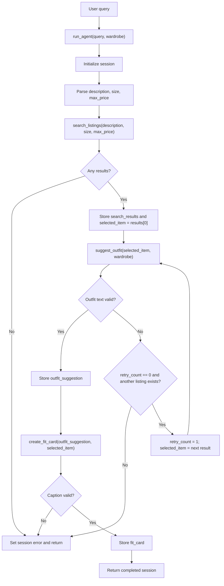

# FitFindr

FitFindr is a multi-tool AI agent for secondhand fashion shopping. A user describes what they want in natural language, the agent searches mock thrift listings, styles one matching item with the user's wardrobe, and turns the outfit into a short shareable fit card.

The project uses:
- Mock listing data from `data/listings.json`
- Wardrobe examples from `data/wardrobe_schema.json`
- Groq `llama-3.3-70b-versatile` for outfit and caption generation
- Gradio for the local demo UI

## Setup

```bash
pip install -r requirements.txt
```

Create a `.env` file in the project root:

```bash
GROQ_API_KEY=your_key_here
```

Run the app:

```bash
python app.py
```

Run the tool tests:

```bash
python -m pytest tests/
```

## Tool Inventory

### `search_listings(description, size, max_price)`

**Purpose:** Search the mock secondhand listings dataset for items that match the user's request.

**Inputs:**
- `description` (`str`): Keywords for the item, such as `"vintage graphic tee"` or `"90s track jacket"`.
- `size` (`str | None`): Optional size filter, such as `"M"`, `"S/M"`, `"W30"`, or `"US 8"`.
- `max_price` (`float | None`): Optional maximum price in dollars.

**Returns:**
- A `list[dict]` of up to 3 matching listing dictionaries, sorted by relevance.
- Each listing dict includes `id`, `title`, `description`, `category`, `style_tags`, `size`, `condition`, `price`, `colors`, `brand`, and `platform`.
- Returns `[]` if no matching listings are found.

### `suggest_outfit(new_item, wardrobe)`

**Purpose:** Use the selected listing and the user's wardrobe to generate outfit suggestions.

**Inputs:**
- `new_item` (`dict`): One listing dictionary returned by `search_listings`.
- `wardrobe` (`dict`): A wardrobe dictionary with an `items` list. Each wardrobe item includes `id`, `name`, `category`, `colors`, `style_tags`, and `notes`.

**Returns:**
- A `str` containing 1-2 outfit suggestions.
- With an example wardrobe, the response names specific owned pieces and explains why they work with the new item.
- With an empty wardrobe, the response gives general styling advice using common basics.
- Returns `""` if the LLM call fails, so the planning loop can handle the failure.

### `create_fit_card(outfit, new_item)`

**Purpose:** Turn an outfit suggestion into a short, shareable caption.

**Inputs:**
- `outfit` (`str`): The outfit suggestion returned by `suggest_outfit`.
- `new_item` (`dict`): The selected listing dictionary.

**Returns:**
- A `str` containing a 1-3 sentence caption that mentions the item, price, platform, and outfit vibe.
- If `outfit` is empty, returns a descriptive error string instead of crashing.
- Returns `""` if the LLM call fails, so the planning loop can report a caption error.

## Planning Loop

The planning loop lives in `run_agent(query, wardrobe)` in `agent.py`. It is adaptive: it checks state after each tool call and only calls the next tool when the required previous result exists.

1. Initialize a `session` dict with the original query, wardrobe, empty result fields, and `retry_count = 0`.
2. Parse the natural language query into:
   - `description`
   - `size`
   - `max_price`
3. Call `search_listings(description, size, max_price)`.
4. If search returns `[]`, set `session["error"]` to a specific no-results message and return early. The agent does not call `suggest_outfit` or `create_fit_card`.
5. If search returns listings, store the full list in `session["search_results"]` and store the first listing in `session["selected_item"]`.
6. Call `suggest_outfit(session["selected_item"], session["wardrobe"])`.
7. If the first outfit attempt fails and another listing exists, set `retry_count = 1`, switch `selected_item` to the next listing from `search_results`, and call `suggest_outfit` one more time.
8. If the second outfit attempt fails, set a specific outfit error and return early.
9. If outfit generation succeeds, store it in `session["outfit_suggestion"]`.
10. Call `create_fit_card(session["outfit_suggestion"], session["selected_item"])`.
11. If caption generation succeeds, store it in `session["fit_card"]` and return the completed session. If not, set a specific caption error.

This means the agent behaves differently for different inputs. A normal query runs all three tools. A no-results query stops immediately after `search_listings`. A failed outfit generation retries once with another matched listing before stopping.

## State Management

State is passed through one `session` dict inside `run_agent()` so that the user does not have to re-enter information between tool calls.

The session stores:

```python
{
    "query": str,
    "parsed": {
        "description": str,
        "size": str | None,
        "max_price": float | None,
    },
    "search_results": list[dict],
    "selected_item": dict | None,
    "wardrobe": dict,
    "outfit_suggestion": str | None,
    "fit_card": str | None,
    "error": str | None,
    "retry_count": int,
}
```

The data flow is:
- `search_listings` returns listing dicts.
- The agent stores the chosen listing as `session["selected_item"]`.
- That exact dict is passed into `suggest_outfit`.
- The outfit string returned by `suggest_outfit` is stored as `session["outfit_suggestion"]`.
- That exact string is passed into `create_fit_card`.
- The final caption is stored as `session["fit_card"]`.

## Architecture



## Error Handling

| Tool | Failure mode | Agent behavior |
|------|--------------|----------------|
| `search_listings` | No listings match the parsed query, so the tool returns `[]`. | The agent sets `session["error"]` to `"No matching listings were found for that description and price range. Try a different search."` and stops before calling later tools. |
| `suggest_outfit` | The LLM call fails or returns an empty string. | The agent tries one alternate listing from `session["search_results"]` if available. If the retry also fails, it sets `session["error"]` to `"Unable to build a complete outfit with your wardrobe and available listings. Try a different search."` |
| `create_fit_card` | The LLM call fails, returns empty text, or receives an empty outfit string. | The agent sets `session["error"]` to `"We created outfit suggestions but couldn't generate a caption. Try again or adjust your query."` |

Concrete tested examples:
- `search_listings("designer ballgown", size="XXS", max_price=5)` returns `[]` without raising an exception.
- Running the full agent with `"designer ballgown size XXS under $5"` returns the no-results error and leaves the outfit and fit card empty.
- `create_fit_card("", item)` returns `"Cannot create a fit card because the outfit suggestion is empty."`
- `suggest_outfit(item, get_empty_wardrobe())` returns general styling advice instead of crashing.

## Example Interaction

User query:

```text
I'm looking for a vintage graphic tee under $30. I mostly wear baggy jeans and chunky sneakers.
```

Agent flow:
1. `run_agent()` parses the query into `description="vintage graphic tee"`, `size=None`, and `max_price=30.0`.
2. `search_listings("vintage graphic tee", None, 30.0)` returns matching listings such as `lst_033` or `lst_006`.
3. The top listing is stored in `session["selected_item"]`.
4. `suggest_outfit(session["selected_item"], session["wardrobe"])` styles that same listing with wardrobe pieces like baggy jeans, chunky sneakers, or combat boots.
5. The returned outfit text is stored in `session["outfit_suggestion"]`.
6. `create_fit_card(session["outfit_suggestion"], session["selected_item"])` creates the final shareable caption.
7. Gradio displays the selected listing, outfit idea, and fit card in three output panels.

## Testing

The tool tests are in `tests/test_tools.py`.

They verify:
- Search returns a list of matching listings.
- Search returns `[]` for an impossible query.
- Search respects price filters.
- Outfit generation handles an empty wardrobe.
- Outfit generation handles the example wardrobe.
- Fit card generation handles empty outfit input.
- Fit card generation returns a caption string.

The LLM-dependent tests use hardcoded mocks, so the test suite is fast and does not require live API calls.

## Spec Reflection

One way the spec helped: defining each tool's inputs and return values before implementation made the state flow straightforward. `search_listings` returns listing dicts, `suggest_outfit` receives one of those dicts, and `create_fit_card` receives the outfit string plus the same selected item.

One implementation divergence: the original starter spec did not include `retry_count`, but the final plan added it to make the one allowed `suggest_outfit` retry explicit and testable. This keeps the adaptive loop simple while still showing behavior that changes based on tool output.

## AI Usage

I used AI assistance in two main ways:

1. **Planning and spec cleanup:** I used AI to clean up and give a sanity check on my project instructions to ensure there weren't any contradictions and that the logic remains consistent and in line with the project expectations given the rubric and the `planning.md` spec. I manually added the given suggestions to ensure my plan wasn't being altered.
2. **Implementation support:** I used the Tool Inventory, Planning Loop, State Management, and Error Handling sections from `planning.md` to guide implementation of the three tools, `run_agent()`, and `handle_query()`. I verified the generated logic against the spec by running tool tests, direct agent checks, and Gradio handler checks.
3. **Polishing and Wrapping up README:*** Similar to the planning support, I used AI to ensure my `README.md` captured all areas of the project and iteratively used it to make sure all sections fully meet rubric expectations. I went back to read the `README.md` to make sure it is consistent with the project and `planning.md`.

I overrode or tightened AI output to reflect project requirements and my spec where needed, especially around query parsing and retry behavior. For example, the agent only retries `suggest_outfit` after a successful search, and it uses another matched listing rather than broadening the original search.

