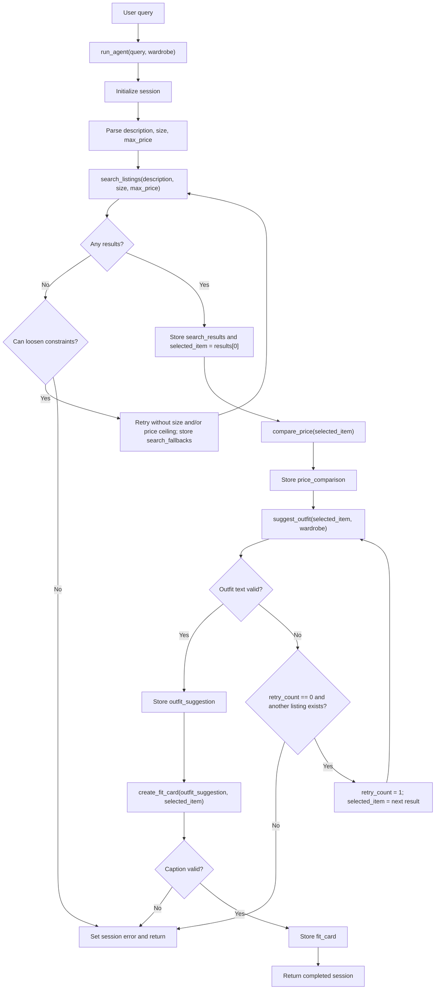

# FitFindr - planning.md

> Complete this document before writing any implementation code.
> Your spec and agent diagram are what you'll use to direct AI tools (Claude, Copilot, etc.) to generate your implementation.
> Your planning.md will be reviewed as part of your submission.
> Update it before starting any stretch features.

---

## Tools

List every tool your agent will use. For each tool, fill in all four fields.
You must have at least 3 tools. The three required tools are listed below.

### Tool 1: search_listings

**What it does:**
Searches `data/listings.json` for secondhand listings that match the user's item description, optional size, and optional maximum price. It filters listings by price and size when those values are provided, scores remaining listings by keyword overlap across title, description, category, colors, and style tags, then returns the best matches.

**Input parameters:**
- `description` (str): Keywords for the item the user wants, such as `"vintage graphic tee"` or `"90s track jacket"`.
- `size` (str or None): Desired size, such as `"M"`, `"S/M"`, `"W30"`, or `"US 8"`. If `None`, the tool does not filter by size.
- `max_price` (float or None): Maximum acceptable price in dollars. If `None`, the tool does not filter by price.

**What it returns:**
- A list of matching listing dicts, sorted by relevance score from highest to lowest.
- Each listing dict contains the 11 fields from `listings.json`: `id`, `title`, `description`, `category`, `style_tags`, `size`, `condition`, `price`, `colors`, `brand`, and `platform`.
- The tool returns up to 3 results. It may return fewer if fewer matches exist.
- If no listings match, it returns an empty list `[]`.

**What happens if it fails or returns nothing:**
- The tool itself returns `[]` instead of raising an exception for no matches.
- The agent sets `session["error"]` to `"No matching listings were found for that description and price range. Try a different search."` and returns early without calling `suggest_outfit` or `create_fit_card`.

---

### Tool 2: suggest_outfit

**What it does:**
Takes one listing from `search_listings` and the user's wardrobe dict, then calls the LLM (Groq `llama-3.3-70b-versatile`) to generate 1-2 outfit suggestions. The suggestions should pair the new listing with pieces the user already owns when possible. If the wardrobe is empty, the tool still gives useful general styling advice instead of failing.

**Input parameters:**
- `new_item` (dict): A single listing dict from `search_listings`, containing `id`, `title`, `description`, `category`, `style_tags`, `size`, `condition`, `price`, `colors`, `brand`, and `platform`.
- `wardrobe` (dict): The user's wardrobe dict from `data/wardrobe_schema.json`, with this shape:

```python
{
    "items": [
        {
            "id": str,
            "name": str,
            "category": str,
            "colors": list[str],
            "style_tags": list[str],
            "notes": str | None,
        }
    ]
}
```

**What it returns:**
- A non-empty string describing 1-2 outfit suggestions.
- Each suggestion should include the new item, 2-4 wardrobe pieces when available, reasoning about why the pieces work together, and optional accessory or styling advice.
- If the wardrobe is empty, the string should describe what kinds of pieces would pair well with the new item.

**What happens if it fails or returns nothing:**
- If the LLM call fails or returns an empty string, the agent treats that as a failed outfit attempt.
- If this was the first `suggest_outfit` failure and the original `search_listings` call returned another matching listing, the agent selects another matching listing and calls `suggest_outfit` one more time.
- If the second `suggest_outfit` attempt also fails, or if there is no alternate listing to try, the agent sets `session["error"]` to `"Unable to build a complete outfit with your wardrobe and available listings. Try a different search."` and returns early.

---

### Tool 3: create_fit_card

**What it does:**
Takes the outfit suggestion string from `suggest_outfit` and the selected listing dict, then calls the LLM to write a short, shareable Instagram-style caption. The caption should sound like a real outfit post, not a product description.

**Input parameters:**
- `outfit` (str): The outfit suggestion text from `suggest_outfit`.
- `new_item` (dict): The selected listing dict, so the caption can reference the item title, price, and platform.

**What it returns:**
- A string containing a 1-3 sentence caption.
- The caption should naturally mention the new item, its price, its platform, and the outfit vibe.
- Example: `"found this vintage band tee on depop for $19 and it instantly made the baggy jeans feel intentional. faded, easy, a little grunge."`

**What happens if it fails or returns nothing:**
- If the LLM call fails or returns empty text, the agent sets `session["error"]` to `"We created outfit suggestions but couldn't generate a caption. Try again or adjust your query."` and returns early.
- If the input `outfit` string is empty, the tool returns a descriptive error message string instead of raising an exception.

---

### Additional Tools

### Tool 4: compare_price

**What it does:**
Estimates whether the selected listing is a good deal, fair price, or pricey compared with similar items in `data/listings.json`. Similar listings are chosen from the same category first, then narrowed by overlapping style tags and colors when possible.

**Input parameters:**
- `item` (dict): The selected listing dict from `search_listings`, containing `id`, `title`, `description`, `category`, `style_tags`, `size`, `condition`, `price`, `colors`, `brand`, and `platform`.

**What it returns:**
- A dict with:
  - `selected_price` (float): the selected item's price
  - `average_price` (float or None): average price among comparable listings
  - `median_price` (float or None): median price among comparable listings
  - `comparable_count` (int): number of comparable listings used
  - `verdict` (str): `"good deal"`, `"fair price"`, `"pricey"`, or `"not enough data"`
  - `explanation` (str): one short sentence explaining the verdict

**What happens if it fails or returns nothing:**
- If no comparable listings are available, the tool returns a low-confidence result with `verdict = "not enough data"` instead of raising an exception.
- The agent still continues to `suggest_outfit` and `create_fit_card`; price comparison is helpful context, not a blocking step.


---

## Planning Loop

**How does your agent decide which tool to call next?**

The planning loop runs in `run_agent(query, wardrobe)` in `agent.py`. It branches based on tool outputs instead of calling all tools unconditionally.

1. **Initialize session**
   - Call `_new_session(query, wardrobe)`.
   - Add `session["retry_count"] = 0` to track the one allowed outfit retry.

2. **Parse the query**
   - Extract `description`, `size`, and `max_price` from the user's natural language query.
   - Store them in `session["parsed"]`.
   - I will start with regex/string parsing because the inputs are simple: dollar amounts for price, common size tokens for size, and the remaining words as the description.

3. **Call `search_listings`**
   - Invoke `search_listings(description, size, max_price)`.
   - Store the result list in `session["search_results"]`.
   - If the list is empty, retry with loosened constraints before returning an error:
     - If `size` was provided, call `search_listings(description, None, max_price)` and record that the size filter was removed.
     - If results are still empty and `max_price` was provided, call `search_listings(description, None, None)` and record that the price ceiling was removed.
     - Store all successful or attempted fallback notes in `session["search_fallbacks"]`.
   - If all search attempts are empty, set `session["error"]` and return early.
   - If the list is not empty, store the first result in `session["selected_item"]`.

4. **Call `compare_price`**
   - Invoke `compare_price(session["selected_item"])`.
   - Store the returned dict in `session["price_comparison"]`.
   - Continue even if the verdict is `"not enough data"`.

5. **Call `suggest_outfit`**
   - Invoke `suggest_outfit(session["selected_item"], session["wardrobe"])`.
   - If the returned string is non-empty, store it in `session["outfit_suggestion"]`.
   - If the returned string is empty or an LLM error prevents useful output, retry once:
     - Set `session["retry_count"] = 1`.
     - Select the next unused item from `session["search_results"]`.
     - If no alternate listing exists, set the outfit error and return early.
     - Call `suggest_outfit` again with the alternate listing.
     - If the second attempt fails, set the outfit error and return early.

6. **Call `create_fit_card`**
   - Invoke `create_fit_card(session["outfit_suggestion"], session["selected_item"])`.
   - If the returned caption is non-empty, store it in `session["fit_card"]` and return the completed session.
   - If the caption is empty or an error message, set `session["error"]` and return the session.

**End condition:** The agent always returns a session dict. On success, it contains `selected_item`, `outfit_suggestion`, and `fit_card`. On failure, it contains a helpful `error` message and stops before calling tools that depend on missing data.

---

## State Management

**How does information from one tool get passed to the next?**

The agent maintains a `session` dict for one user interaction. Tools are standalone functions and do not read from or write to the session directly. The planning loop is responsible for storing each tool result and passing it into the next tool.

**Session dict structure:**

```python
session = {
    "query": str,                  # Original user query.
    "parsed": dict,                # {"description": str, "size": str | None, "max_price": float | None}
    "search_results": list[dict],  # Up to 3 listing dicts returned by search_listings.
    "selected_item": dict | None,  # Listing passed into suggest_outfit and create_fit_card.
    "wardrobe": dict,              # User wardrobe from get_example_wardrobe() or get_empty_wardrobe().
    "outfit_suggestion": str | None,
    "fit_card": str | None,
    "error": str | None,
    "retry_count": int,            # 0 normally, 1 after the one allowed suggest_outfit retry.
    "search_fallbacks": list[str],  # Notes about loosened search constraints, if any.
    "price_comparison": dict | None # Result from compare_price(selected_item).
}
```

**Data flow:**
1. `run_agent()` initializes the session.
2. Query parsing writes `description`, `size`, and `max_price` into `session["parsed"]`.
3. `search_listings()` returns matching listings, which are stored in `session["search_results"]`.
4. If the first search fails, fallback search notes are stored in `session["search_fallbacks"]`.
5. The agent chooses a listing and stores it in `session["selected_item"]`.
6. `compare_price()` receives `session["selected_item"]`, and the result is stored in `session["price_comparison"]`.
7. `suggest_outfit()` receives `session["selected_item"]` and `session["wardrobe"]`.
8. If the first outfit attempt fails, the agent updates `session["selected_item"]` to the next listing and retries once.
9. `create_fit_card()` receives `session["outfit_suggestion"]` and `session["selected_item"]`.
10. If any required step fails, `session["error"]` is set and later dependent tools are not called.

**Tool access pattern:**
- Tools are pure function-style helpers: they accept arguments and return values.
- Session updates happen only inside the planning loop in `agent.py`.
- This keeps tool behavior easy to test in isolation before wiring the full agent.

---

## Error Handling

For each tool, describe the specific failure mode being handled and what the agent does in response.

| Tool | Failure mode | Agent response |
|------|--------------|----------------|
| `search_listings` | No listings match the query and the tool returns `[]`. | Retry once without the size filter if size was provided, then retry once without the price ceiling if needed. Record each adjustment in `session["search_fallbacks"]`. If all attempts fail, set `session["error"]` to `"No matching listings were found for that description and price range. Try a different search."` and return early. |
| `compare_price` | No comparable listings are available. | Return `verdict = "not enough data"` with an explanation. The agent stores the result and continues because price comparison is not required for outfit generation. |
| `suggest_outfit` first attempt | LLM call fails, raises an exception caught by the agent, or returns an empty/whitespace string. | If another listing exists in `session["search_results"]`, set `retry_count` to 1, update `selected_item` to the alternate listing, and call `suggest_outfit` one more time. |
| `suggest_outfit` second attempt | Retry also fails or there is no alternate listing to try. | Set `session["error"]` to `"Unable to build a complete outfit with your wardrobe and available listings. Try a different search."` and return early. |
| `suggest_outfit` with empty wardrobe | `wardrobe["items"]` is empty. | This is not an error. The tool asks the LLM for general styling advice and the workflow continues to `create_fit_card`. |
| `create_fit_card` | LLM call fails or returns an empty/whitespace string. | Set `session["error"]` to `"We created outfit suggestions but couldn't generate a caption. Try again or adjust your query."` and return early. |
| `create_fit_card` empty outfit input | `outfit` is empty before the LLM call. | The tool returns a descriptive error message string. The agent treats it as a failed caption and sets `session["error"]`. |

---

## Architecture



**Key flow points:**
- All decisions happen in the `run_agent()` planning loop in `agent.py`.
- `search_listings` gets a limited fallback path before the agent returns a no-results error.
- `compare_price` runs after the selected listing is chosen and does not block the workflow.
- `suggest_outfit` gets one retry with another matched listing if the first outfit attempt fails.
- `create_fit_card` only runs after a valid outfit suggestion exists.
- Error paths return early with `session["error"]` populated.

---

## AI Tool Plan

**Milestone 1 - Explore starter repo and data**
- Read `data/listings.json`, `data/wardrobe_schema.json`, `utils/data_loader.py`, `tools.py`, `agent.py`, and `app.py`.
- Confirm that listing items use `title`, while wardrobe items use `name`.
- Confirm that helper functions `load_listings()`, `get_example_wardrobe()`, and `get_empty_wardrobe()` should be reused.
- Commit after the planning document accurately reflects the starter files.

**Milestone 2 - Finalize spec before code**
- Use this `planning.md` as the implementation spec.
- Verify the tool signatures match `tools.py`: `search_listings(description, size, max_price)`, `suggest_outfit(new_item, wardrobe)`, and `create_fit_card(outfit, new_item)`.
- Verify the session fields match `_new_session()` in `agent.py`, with `retry_count` added intentionally for the one retry.
- Commit the finalized planning document before implementation.

**Milestone 3 - Implement and test tools in isolation**
- For `search_listings`, give ChatGPT the Tool 1 section and ask for an implementation using `load_listings()`.
- For `suggest_outfit`, give the Tool 2 section and ask for a Groq prompt that handles both populated and empty wardrobes.
- For `create_fit_card`, give the Tool 3 section and ask for a Groq prompt that returns a casual 1-3 sentence caption.
- Verify each tool manually before wiring the agent:
  - `search_listings("vintage graphic tee", size=None, max_price=50)` returns a non-empty list with prices at or below 50.
  - `search_listings("designer ballgown", size="XXS", max_price=5)` returns `[]`.
  - `suggest_outfit(item, get_empty_wardrobe())` returns useful styling advice.
  - `create_fit_card("", item)` returns a descriptive error message string.
- Add `tests/test_tools.py` with pytest tests for normal search, empty search, price filtering, empty wardrobe handling, and empty outfit input.
- Commit after the tools and tool tests pass.

**Milestone 4 - Implement planning loop and Gradio integration**
- Give Claude or ChatGPT the Planning Loop, State Management, Error Handling, and Architecture sections.
- Implement `run_agent()` in `agent.py` so it:
  - Parses the query.
  - Calls `search_listings`.
  - Returns early if search has no results.
  - Calls `suggest_outfit`.
  - Retries `suggest_outfit` once with another matched listing if the first outfit attempt fails.
  - Calls `create_fit_card` only after a valid outfit suggestion.
- Implement `handle_query()` in `app.py` so it selects the example or empty wardrobe, calls `run_agent()`, formats the selected listing, and maps session output to the three Gradio panels.
- Test the happy path and no-results path from the command line before launching Gradio.
- Commit after the planning loop works from `python agent.py`.

**Milestone 5 - Test failure modes deliberately**
- Trigger no search results and confirm the agent returns the search error without calling later tools.
- Trigger `suggest_outfit` with an empty wardrobe and confirm it still returns styling advice.
- Temporarily simulate a first `suggest_outfit` failure and confirm the agent retries once with another matched listing.
- Simulate a second `suggest_outfit` failure and confirm the agent sets the outfit error.
- Trigger `create_fit_card` with empty outfit input and confirm a descriptive error response.
- Commit after all failure paths are verified.

**Milestone 6 - Document and record**
- Update `README.md` with tool inventory, planning loop, state management, error handling examples, AI usage, and spec reflection.
- Run `python app.py`, test a full happy path in Gradio, and test at least one failure path.
- Record a 3-5 minute demo showing all three tools, state passing, and one graceful failure.
- Commit README and any final polish before submission.

---

## A Complete Interaction (Step by Step)

Write out what a full user interaction looks like from start to finish - tool call by tool call.

**Example user query:** `"I'm looking for a vintage graphic tee under $30. I mostly wear baggy jeans and chunky sneakers. What's out there and how would I style it?"`

**Parse and setup:**
- `run_agent()` is called with the user query and the selected wardrobe dict from `get_example_wardrobe()`.
- Session is initialized with the starter fields from `_new_session()` plus `retry_count = 0`.
- Agent extracts:
  - `description = "vintage graphic tee"`
  - `size = None`
  - `max_price = 30.0`

**Step 1 - `search_listings`:**
- Agent calls `search_listings("vintage graphic tee", size=None, max_price=30.0)`.
- Tool searches `listings.json`, filters by price at or below 30, and scores keyword overlap for terms like `"vintage"`, `"graphic"`, and `"tee"`.
- Expected matching results include real dataset items such as:
  - `lst_033`: `"Vintage Band Tee - Faded Grey"`, price `19.00`, size `"L"`, platform `"depop"`
  - `lst_006`: `"Graphic Tee - 2003 Tour Bootleg Style"`, price `24.00`, size `"L"`, platform `"depop"`
- Agent stores the full results list in `session["search_results"]`.
- Agent stores the first listing in `session["selected_item"]`.

**Step 2 - `suggest_outfit`:**
- Agent calls `suggest_outfit(session["selected_item"], session["wardrobe"])`.
- Tool sends the selected listing plus wardrobe pieces such as `"Baggy straight-leg jeans, dark wash"`, `"Chunky white sneakers"`, and `"Black combat boots"` to the LLM.
- LLM returns an outfit suggestion, for example:
  `"Pair the faded grey band tee with your baggy straight-leg jeans and black combat boots for a relaxed grunge look. Add the black crossbody bag to keep it practical, and use the brown leather belt to give the oversized shape some structure."`
- Agent stores that string in `session["outfit_suggestion"]`.

**Step 2 retry path - only if first outfit attempt fails:**
- If the first `suggest_outfit` call returns empty text, the agent checks for another listing in `session["search_results"]`.
- If another listing exists, the agent sets `session["retry_count"] = 1`, updates `session["selected_item"]` to the next listing, and calls `suggest_outfit()` again.
- If the second attempt fails, the agent sets `session["error"]` to the outfit error and returns early.

**Step 3 - `create_fit_card`:**
- Agent calls `create_fit_card(session["outfit_suggestion"], session["selected_item"])`.
- Tool sends the outfit text and selected item details to the LLM.
- LLM returns a caption, for example:
  `"found this faded grey band tee on depop for $19 and it immediately made the baggy jeans feel like a full look. keeping it easy with boots, a crossbody, and a little worn-in grunge energy."`
- Agent stores that caption in `session["fit_card"]`.

**Return to user:**
- The first Gradio panel displays the selected listing title, price, size, condition, platform, colors, and style tags.
- The second panel displays `session["outfit_suggestion"]`.
- The third panel displays `session["fit_card"]`.

**Search error path example:**
If `search_listings("designer ballgown", size="XXS", max_price=5)` returns `[]`, the agent:
1. Sets `session["error"]` to `"No matching listings were found for that description and price range. Try a different search."`
2. Returns early without calling `suggest_outfit` or `create_fit_card`.
3. Displays the error in the first output panel and leaves the other panels empty.
